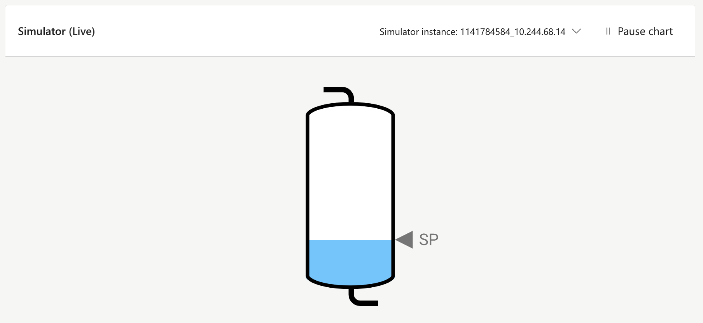

# Bonsai Cartpole Visualizer Examples

## Intro

The Bonsai App visualizer plugin API is intended to allow you to create custom visualizations of your simulation state and action space. These visualizations can be loaded into the Bonsai App when displaying episode data, making it easier to understand.

The Bonsai App will send updated state that follows the user’s cursor when they hover over chart data.

## Overview

Plugins are URLs to a JavaScript web application hosted somewhere that the user’s browser can access. These URLs are loaded into an IFrame by the Bonsai App. You will need to provide your own hosting for your plugins.

You can use pure JavaScript, or a web framework like React or Angular. We use the Window.postMessage() API to communicate with the plugin in the IFrame.

The plugin will also be passed a variety of query parameters when it is loaded. Some of them are reserved by the plugin API, but a developer can have the user pass in additional configuration parameters as necessary.

## Cart + Pole

## Simple Tank

## Plastics Extruder

## Contributing

This project welcomes contributions and suggestions. Most contributions require you to agree to a
Contributor License Agreement (CLA) declaring that you have the right to, and actually do, grant us
the rights to use your contribution. For details, visit https://cla.opensource.microsoft.com.

When you submit a pull request, a CLA bot will automatically determine whether you need to provide
a CLA and decorate the PR appropriately (e.g., status check, comment). Simply follow the instructions
provided by the bot. You will only need to do this once across all repos using our CLA.

This project has adopted the [Microsoft Open Source Code of Conduct](https://opensource.microsoft.com/codeofconduct/).
For more information see the [Code of Conduct FAQ](https://opensource.microsoft.com/codeofconduct/faq/) or
contact [opencode@microsoft.com](mailto:opencode@microsoft.com) with any additional questions or comments.

## Trademarks

This project may contain trademarks or logos for projects, products, or services. Authorized use of Microsoft
trademarks or logos is subject to and must follow
[Microsoft's Trademark & Brand Guidelines](https://www.microsoft.com/en-us/legal/intellectualproperty/trademarks/usage/general).
Use of Microsoft trademarks or logos in modified versions of this project must not cause confusion or imply Microsoft sponsorship.
Any use of third-party trademarks or logos are subject to those third-party's policies.
